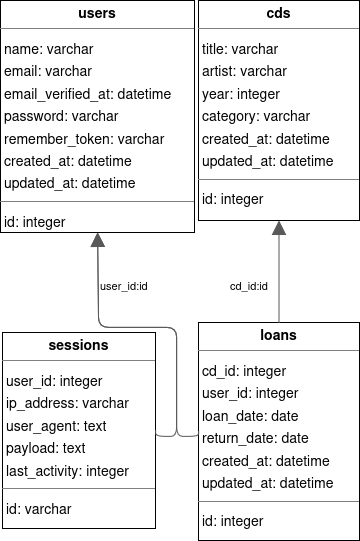

# Médiathéque

## Objectif

Créer une liste de CD pour proposer à la suite aux clients.
La médiathèque prête les CD que les clients peuvent prendre.

## Outils utiliser

* Laravel V11
* [MailPit](https://github.com/axllent/mailpit)

### Diagramme pour la base de donnée pour les CD



## Ligne de commande

Install PHP dependencies:

```bash
composer install
```

Install NPM dependencies:

```bash
npm install
```

Build assets:

```bash
npm run dev
```

Setup configuration:

```bash
cp .env.example .env
```

Generate application key:

```bash
php artisan key:generate
```

Create an SQLite database. You can also use another database (MySQL, Postgres), simply update your configuration
accordingly.

```bash
touch database/database.sqlite
```

Run database migrations:

```bash
php artisan migrate
```

Run database seeder:

```bash
php artisan db:seed
```

Run artisan server:

```bash
php artisan serve
```

After launch artisan server, view app with link: http://localhost:8000/

### Compte disponible

| Privilège      | Adresse mail      | Mot de passe |
|----------------|-------------------|--------------|
| Administrateur | admin@example.com | password     |
| Utilisateur    | user@example.com  | password     |
